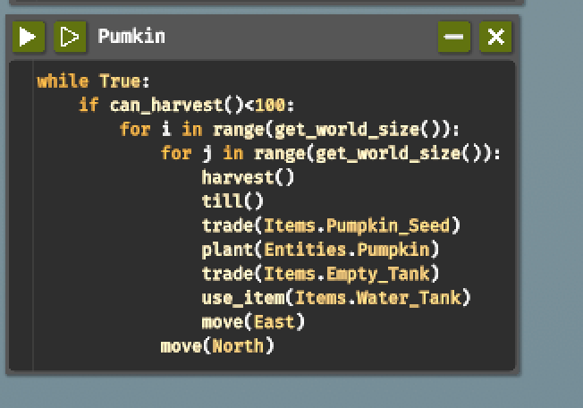
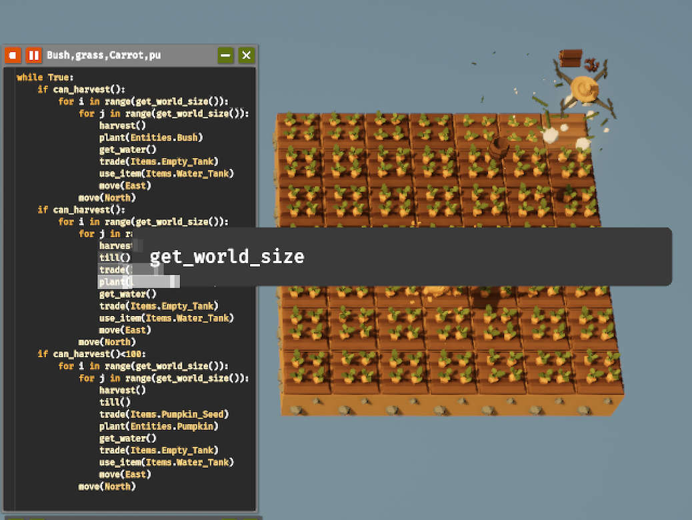
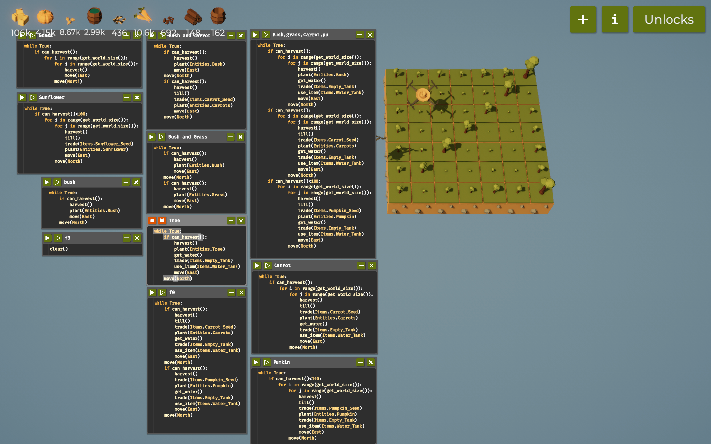
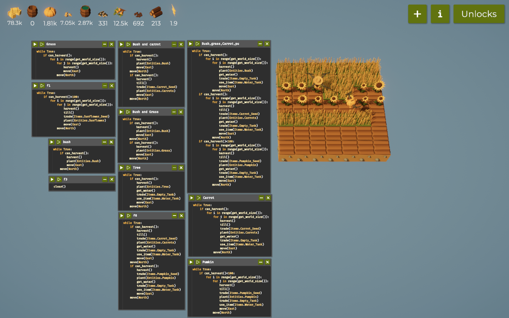
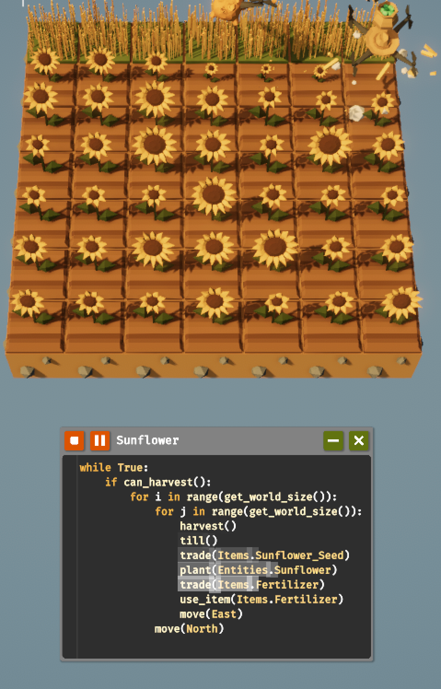

# -SWE_CAP2_Game_Automation-
## Introduction 
- The Farmer Was Replaced is a programming game where we control a farming drone, telling it to plant and harvest crops, add water and 
fertilizer, etc. The game The Famer Was Replace is mainly based on understanding the problem and writing codes to slove. Program and 
optimize a drone to automate a farm and watch it do the work for us. Collect resources to unlock better technology and become the most 
efficient farmer in the world. Improve our problem solving and coding skills.

- Overview
I started with a small piece of land, learning how to plant crops and take care of them. The game was easy to pick up, and I felt the 
pressure of each choice I made. I had to plant crops while being aware of automated harvesters. At first, I’m just trying to plant basic 
crops and learn. I start with a few seeds . The controls are simple, so I quickly get the hang of watering, planting, and harvesting. Every 
decision feels important as if we did one mistake it can harms other codes.

# Table of Contents
- [Code Snippets and Explanation]
- [Challenges and Learnings]
- [References]

# Code-Snippets-and-Explanation
## Step 1: Farming on 1 tile
**Code:**
```python
harvest()
do a flip()
```
- This code harvest the hay and it will flip after one harvest. After collecting more hay we can unlock the while loop code where the code 
will harvest continusely.


**After being unlocked while Ture**
```python
while True:
   if can_harvest():
      harvest()
```
- After unlocking the while loop code it will continusely harvest. And can_harvest will harvest the plant that are fully grown.

**Notes**
- Using the code above I was able to get enough hay to unlock the tile
- These features were unlocked too: while.

## Step 2: Farming on 3x1 tile
**Code**
```python
while True:
   if can_harvest():
      harvest()
      move(North)
```
- After upgrading 3x1 tiles we will get a new code (move) where this code will command the drone to move north and harvest after being moved.
- To upgrade 3x3 tiles we need a bush and a hay so to do that we need to plant a bush. To do that we have a code below.

**Code**
```python
while True:
   if can_harvest():
      harvest()
      plant(Entities.Bush)
      move(North)
```


**Notes**
- Using the code above I was able to get enough bush to unlock carrots 
- These features were unlocked too: if, for, get_world_size, senses and etc...

## Step 3: Farming on 3x3 tile
**Code**
```python
while True:
   if can_harvest():
      for i in range(get_world_size()):
         for j in range(get_workd_size()):
            harvest()
            plant(Entities.Bush)
            move(North)
            move(East)
```
- In the code i have used for loop and have harvest as the for i in range(get_world_size) will define where to go and how much to go and 
harvest. This code helps in  getting the whole fild harvest in sequence.
- After harvesting for long time we will be able to unlock carrots .

**Code**
```python
while True:
   if can_harvest():
      for i in range(get_world_size()):
         for j in range(get_workd_size()):
            harvest()
            till()
            trade(Items.Carrots_seed)
            plant(Entities.Carrots)
            move(North)
            move(East)
```
- Same as the above code after unlocking carrots i have used till() where it will dig the ground and the trade(Items.Carrots_seed) code will 
trade the seed with bush and finally it will plant the carrot and it will harvest.


**Notes**
- Using the code above I was able to get enough carrots and bush where it help me to unlock the tiles 
- These features were unlocked too: Debug, operator, varables and functions.

## Step 4: Farming on 4x4 tile
**Code**
```python
while True:
   if can_harvest()<100:
      for i in range(get_world_size()):
         for j in range(get_workd_size()):
            harvest()
            till()
            trade(Items.Pumkin_seed)
            plant(Entities.Pukmkin)
            move(North)
            move(East)
```
- After farming for an hours i was able to unlock Operators, Variables and Functions. 
### Operators
Symbols for operations (e.g., +, -, ==).
### Variables
Named storage for values (e.g., age = 25).
### Functions
Reusable code blocks that perform tasks (e.g., def greet(name):).

- After unlocking this functions i was able to unlock Pumpkins where it was same as carrots buts where as carrot it trade with bush and 
pumpkins trade with carrots and in the above code i have used operations (if can_harvest()<100:) beacuse with out the operators i was not 
able harvest the pumpkins continusely where if i used that operator i will be able to harvest more than hunderds.


**Notes**
- Using the code above I was able to get enough pumpkins and upgraded the tiles 
- These features were unlocked too: utilities, list, polyculuture and mazes.
## Step 5: Farming on 7x7 tile
- I kept on farming for long hours and i upgrade the speed and Expand and made the grass max.
**Code**
```python
while True:
    if can_harvest():
        for i in range(get_world_size()):
            for j in range(get_world_size()):
                harvest()
                plant(Entities.Bush)
                get_water()
                trade(Items.Empty_Tank)
                use_item(Items.Water_Tank)
                move(East)
            move(North)
    if can_harvest():
        for i in range(get_world_size()):
            for j in range(get_world_size()):
                harvest()
                till()
                trade(Items.Carrot_Seed)
                plant(Entities.Carrots)
                get_water()
                trade(Items.Empty_Tank)
                use_item(Items.Water_Tank)
                move(East)
            move(North)
    if can_harvest()<100:
        for i in range(get_world_size()):
            for j in range(get_world_size()): harvest()
                till()
                trade(Items.Pumpkin_Seed)
                plant(Entities. Pumpkin)
                get_water()
                trade(Items. Empty_Tank)
                use_item(Items.Water_Tank)
                move(East)
            move(North)
```
- Harvesting for a long hours i found that the code were similar so i have combine the pumpkins, carrots and bush together where the code
will commad to harvest one after one and i have also unloked the water also and the water helps to grow the plants faster and the to use 
water first we have to command to get water and trade with the empty tank where later this enpty tank will refilled and use in plants.

**Code**
```python
while True:
   if can_harvest():
      for i in range(get_world_size()):
         for j in range(get_workd_size()):
            harvest()
            plant(Entities.Tree)
            get_water()
            trade(Items. Empty_Tank)
            use_item(Items.Water_Tank)
            move(North)
        move(East)
```
- This code are same as above but the command are differnt where it plant tree and gives more like bush and i have used water so it can grow fater and can haverst.

**Code**
```python
while True:
   if can_harvest()<100:
      for i in range(get_world_size()):
         for j in range(get_workd_size()):
            harvest()
            till()
            trade(Items.Sunflower_seed)
            plant(Entities.Sunflower)
            trade(Items.Fertilizer)
            use_items(Items.Fertilizer)
            move(North)
        move(East)
```
- I was able to unlock sunflower with punmkin and carrots and the code to command was same for the sunflower where it collects power from the sun.
- And in the avove code i have used Fertilizer after trading it and useing after being trade. The code Use_items will use the items that are commande inside the brackets 



**Notes**
- Using the code above I was able to get enough carrots hay and etc..
- These features were unlocked too: mazes.

# Challenges and Learnings
## Challenges
- The challange that i face were getting the code correct to run and loops where it could harvest continuse and some challange are time too as i have to wait until i meet the need to unlock or upgrade.
- some challenge can be also laptop heat up as we have to wait until it fulfull the need it takes more time and laptop batterys consume more and gets more heat up.
- As there is limitd clues it was harder for us to know to code to command correctly and as there is different references with different solutions it was challanging for us to understand it.
## Learnings
- While playing this game i have learn to check errors and it helped me to gain more knowlege on loops, variables, operator and etc...
- And this game also helped in developing our planning stratiges as befor we harvest we need to know should it haevest and when to harvest.
- As the game it self us mainly based on programing it aims to develop more knowledge on programming and helped us to maintain a Adaptability
## References
- Youtube
https://youtu.be/os3nqnYxpkI
